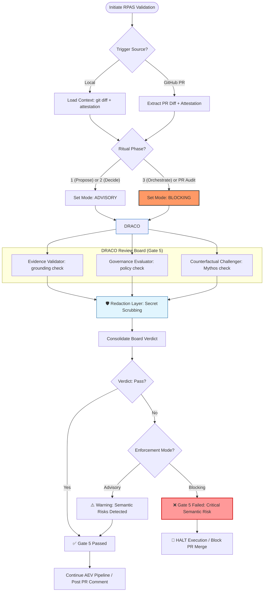

> **Source:** [`governance/visuals/Gate-5-Flow.md`](https://github.com/mdresch/adpa/blob/adpa-project-charter/governance/visuals/Gate-5-Flow.md) — branch `adpa-project-charter`, repository [mdresch/adpa](https://github.com/mdresch/adpa).

# ✅ **RPAS‑CM Gate 5 Control‑Flow (DRACO)**

The following diagram illustrates the **Semantic Integrity** validation flow during the RPAS lifecycle, including the newly integrated **Collaborative PR Governance** and **Redaction Layer**.

---

## **Key Governance Invariants**

1.  **Authority Sovereignty**: AI cannot block human decisions (Gate 5 = Advisory during Phase 2).
2.  **Execution Immunity**: AI cannot execute ambiguous or unauthorized logic (Gate 5 = Blocking during Phase 3).
3.  **Mythos Prevention**: The Counterfactual Challenger specifically audits for "Shadow Initiative" that was NOT requested in the attestation.
4.  **Semantic Security (Redaction)**: All findings surfaced to collaborative environments (GitHub PRs) are automatically redacted of sensitive tokens and identifiers.

---
**Baseline**: RPAS-CM v2.4.0 (CSR-43)
**Owner**: DRACO AI Review Board
