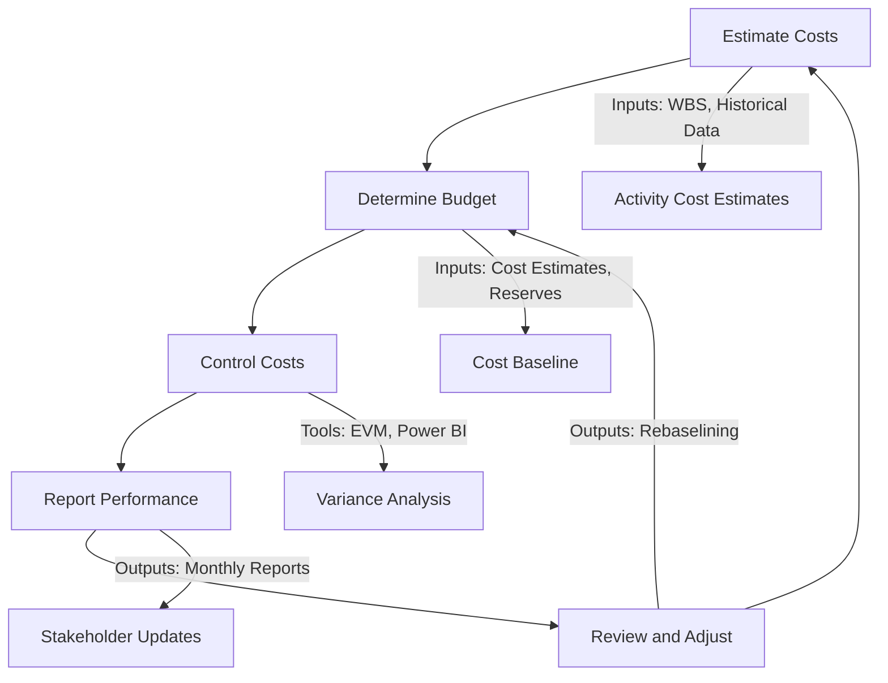

Confidentiality Level: NATO Confidential

Framework: PMBOK® Guide (7th Edition)

---

# Cost Management Plan

**Project:** Alliance Resilience Project

**Project ID:** 08bef030-8f72-4360-a3b0-dc0192bf4405

**Version:** 1.0

**Date:** 2025-04-10

**Prepared By:** Menno Drescher, Project Manager

─────────────────────────────────────────────────────────

## 1. Executive Summary

### 1.1 Purpose
The Cost Management Plan (CMP) for the Alliance Resilience Project establishes a structured framework for estimating, budgeting, monitoring, and controlling project costs in alignment with PMBOK® Guide (7th Edition) principles. This plan ensures financial transparency, accountability, and value delivery by defining cost estimation methods, budget baselines, control processes, and performance measurement metrics. Given the project’s strategic importance to NATO Air Command, this document integrates the Uncertainty, Measurement, and Delivery Performance Domains to address cost-related risks, compliance requirements, and stakeholder expectations.

### 1.2 Project Overview
The Alliance Resilience Project aims to develop a modular Automated Diplomatic Protocol Automation (ADPA) system to streamline diplomatic clearances and asset relocations for VIP aircraft (e.g., Qatari 747-8) across NATO/EU hubs such as Lelystad and Schiphol. Key features include:

- Predictive drift detection for militia threats (leveraging AI/ML models).
- 48-hour airstrip orchestration via baseline extraction from NATO’s Air Command and Control System (ACCS).
- Need-to-know compliance logs for operational readiness.
- Integration with EU Diplomatic Clearance Portal and NATO Threat Intelligence Databases.

The project’s success hinges on delivering 60% faster diplomatic clearance processing, 90% improved threat detection accuracy, and full operational readiness within 24 months (as outlined in the Business Case and Scope Management Plan).

### 1.3 Alignment with PMBOK 7th Edition
This CMP aligns with PMBOK 7’s Performance Domains and Principles:

| Performance Domain | Alignment in CMP |
|---|---|
| Stakeholders | Defines roles/responsibilities for NATO Air Command, EU Member States, and vendors. |
| Team | Assigns cost ownership to the Finance Lead, Procurement Manager, and PM. |
| Development Approach | Uses agile budgeting for iterative ADPA system development. |
| Measurement | Implements Earned Value Management (EVM) with CPI/SPI targets. |
| Uncertainty | Includes cost contingency reserves (10% for known risks, 5% for unknowns). |
| Delivery | Links cost baselines to milestone-based funding (e.g., MVP, full deployment). |
| Project Work | Integrates cost control with Integration Management Plan processes. |

─────────────────────────────────────────────────────────

## 2. Cost Overview

### 2.1 Cost Management Objectives
The primary objectives of cost management for the Alliance Resilience Project are:

| Objective | Description | Success Metric | Target Date |
|---|---|---:|---|
| Accurate Cost Estimation | Develop realistic cost estimates using historical data and expert judgment. | ±10% variance from final actual costs. | 2025-06-30 |
| Budget Adherence | Ensure project execution stays within the approved budget baseline. | ≤5% cost variance (CV) at project completion. | 2027-12-31 |
| Value Delivery | Optimize cost efficiency while maximizing operational resilience benefits. | CPI ≥ 0.95; ROI ≥ 20% over 5 years (per Business Case). | 2027-12-31 |
| Risk-Responsive Budgeting | Allocate contingency reserves for identified risks (e.g., vendor delays, scope changes). | 100% coverage of high-probability/high-impact risks. | 2025-07-31 |
| Stakeholder Transparency | Provide real-time cost reporting to NATO Air Command and EU Member States. | Monthly cost reports delivered on time with ≤2% data errors. | Ongoing |

### 2.2 Cost Constraints and Assumptions

**Constraints**
1. Fixed Funding Sources: Budget is constrained by NATO Air Command’s annual allocation (€25M) and EU grants (€5M).
2. Regulatory Compliance: Costs must align with NATO Financial Regulations and EU Public Procurement Directives.
3. Timeline Pressure: MVP must be delivered by 2026-06-30 to meet operational readiness goals (per Project Charter).
4. Vendor Dependencies: Third-party AI/ML vendors may introduce cost variability (e.g., model training, licensing).

**Assumptions**
1. Labor Rates: NATO internal labor costs are fixed at €120/hour for technical staff and €90/hour for support staff.
2. Exchange Rates: USD/EUR exchange rate is fixed at 1.10 for budgeting purposes.
3. Inflation: Annual inflation rate of 2% is applied to long-term contracts.
4. Vendor Stability: Third-party vendors will adhere to fixed-price contracts (per Procurement Manager).
5. Scope Stability: No major scope changes after 2025-09-30 (per Scope Management Plan).

─────────────────────────────────────────────────────────

## 3. Estimation Methods

### 3.1 Cost Estimation Approach
The Alliance Resilience Project employs a hybrid estimation methodology combining analogous, parametric, and bottom-up techniques to ensure accuracy and stakeholder buy-in.

| Method | Description | Tools | Inputs | Outputs |
|---|---|---|---|---|
| Analogous | Uses costs from similar NATO projects (e.g., Kabul evacuation automation). | Excel, NATO PMO Library | Historical data from NATO’s ACCS upgrades. | High-level budget estimate (±25% accuracy). |
| Parametric | Applies statistical models to estimate costs (e.g., cost per diplomatic clearance automated). | COCOMO II, Jira | Scope Management Plan (WBS), vendor quotes for AI/ML model training. | Mid-level budget estimate (±15% accuracy). |
| Bottom-Up | Aggregates detailed cost estimates for each WBS work package. | Microsoft Project, Excel | WBS Dictionary, labor rates, vendor contracts, hardware/software quotes. | Detailed budget estimate (±5% accuracy). |
| Three-Point | Uses optimistic, pessimistic, and most likely estimates to calculate a weighted average (PERT). | Excel, Monte Carlo Simulation | Expert judgment from Lead Architect and AI/ML Engineer. | Risk-adjusted cost ranges. |

### 3.2 Cost Estimation Process
1. Define Scope: Align with Scope Management Plan (WBS, deliverables).
2. Gather Data: Collect historical costs (NATO PMO Library), vendor quotes, and labor rates.
3. Select Methods: Apply analogous for high-level estimates, bottom-up for detailed work packages.
4. Validate Estimates: Review with Finance Lead and Procurement Manager.
5. Document Assumptions: Record constraints, risks, and dependencies (e.g., vendor lead times).
6. Obtain Approval: Submit to Change Control Board (CCB) for baseline approval.

### 3.3 Cost Estimation Outputs
| Output | Description | Owner |
|---|---|---|
| Activity Cost Estimates | Detailed cost breakdown for each WBS work package (e.g., AI model training: €1.2M). | Finance Lead |
| Basis of Estimates | Documentation of assumptions, methods, and data sources. | Project Manager |
| Cost Management Plan Updates | Revisions to this CMP based on estimation findings. | Project Manager |

─────────────────────────────────────────────────────────

## 4. Budget Baseline

### 4.1 Budget Development Process
The cost baseline is developed by aggregating cost estimates from the WBS and adding contingency reserves for risks. The process includes:

1. Aggregate Estimates: Sum costs for all work packages (e.g., software development, hardware procurement).
2. Add Contingency Reserves:
- 10% for known risks (e.g., vendor delays, scope changes).
- 5% for unknown risks (e.g., geopolitical disruptions).
3. Time-Phase Budget: Allocate costs to project phases (e.g., Inception: €5M, MVP: €12M, Full Deployment: €8M).
4. Obtain Approval: Submit to NATO Financial Compliance Team and CCB for sign-off.

### 4.2 Budget Breakdown
The table below outlines the approved budget baseline (€30M total):

| Category | Estimated Cost (€) | Notes |
|---|---:|---|
| Software Development | 12,000,000 | Includes AI/ML model training, ADPA system coding, and integration with NATO/EU systems. |
| Hardware Procurement | 4,500,000 | Servers, networking equipment, and redundancy systems for NATO hubs. |
| Vendor Contracts | 3,000,000 | Third-party AI/ML vendors, cloud hosting (AWS GovCloud). |
| Labor Costs | 6,000,000 | NATO internal staff (€120/hour), consultants (€150/hour). |
| Contingency Reserves | 3,000,000 | 10% for known risks, 5% for unknowns. |
| Training & Change Management | 1,500,000 | End-user training for NATO Air Command Operations Team. |
| **Total** | **30,000,000** | |

### 4.3 Funding Sources
| Source | Amount (€) | Schedule | Conditions |
|---|---:|---|---|
| NATO Air Command | 25,000,000 | Quarterly allocations (2025-2027) | Approved by NATO Financial Compliance Team; aligned with annual budget cycles. |
| EU Grants | 5,000,000 | Annual disbursement (2025-2026) | Compliance with EU Public Procurement Directives; milestone-based payments. |

### 4.4 Payment Schedule
| Milestone | Target Date | Payment (€) | Funding Source | Conditions |
|---|---|---:|---|---|
| Project Kickoff | 2025-05-01 | 3,000,000 | NATO Air Command | Signed contracts with vendors; approved WBS. |
| Inception Phase | 2025-12-31 | 5,000,000 | NATO Air Command | Completion of system architecture; approved risk management plan. |
| MVP Delivery | 2026-06-30 | 12,000,000 | NATO + EU Grants | Successful UAT; compliance with NATO Threat Intelligence Databases. |
| Full Deployment | 2027-06-30 | 8,000,000 | NATO Air Command | Operational readiness; 95% user adoption. |
| Project Closure | 2027-12-31 | 2,000,000 | NATO Air Command | Lessons learned documented; final audit completed. |

─────────────────────────────────────────────────────────

## 5. Control Processes

### 5.1 Cost Control Framework
The Alliance Resilience Project employs Earned Value Management (EVM) to monitor cost performance and trigger corrective actions. Key processes include:

| Process | Description | Tools | Frequency |
|---|---|---|---|
| Performance Measurement | Track CPI, SPI, CV, and SV against baselines. | Power BI, Microsoft Project | Monthly |
| Variance Analysis | Identify cost/schedule variances and root causes (e.g., vendor delays, scope changes). | Excel, Jira | Monthly |
| Corrective Actions | Implement fixes (e.g., rebaselining, resource reallocation, scope adjustments). | CCB, Risk Management Plan | As needed |
| Reporting | Provide cost reports to NATO Air Command and EU Member States. | Power BI Dashboards | Monthly |

### 5.2 Variance Thresholds
| Metric | Target | Threshold | Action |
|---|---:|---:|---|
| CPI | ≥ 0.95 | < 0.90 | Escalate to CCB; review scope and resource allocation. |
| SPI | ≥ 0.95 | < 0.90 | Adjust schedule; fast-track critical path activities. |
| Cost Variance | ≤ 5% | > 10% | Freeze non-critical spending; activate contingency reserves. |
| Schedule Variance | ≤ 5% | > 10% | Reallocate resources; negotiate vendor deadlines. |

### 5.3 Corrective Actions
| Variance Type | Possible Causes | Corrective Actions | Owner |
|---|---|---|---|
| Cost Overrun | Vendor delays, scope changes, inflation | - Rebaseline budget with CCB approval.  - Reallocate resources from non-critical tasks. | Project Manager |
| Schedule Delay | Resource shortages, technical challenges | - Fast-track critical path activities.  - Add overtime or temporary staff. | Technical Lead |
| Underutilized Budget | Overestimation, scope reduction | - Reallocate funds to high-risk areas.  - Accelerate training or testing phases. | Finance Lead |

### 5.4 Cost Control Tools
| Tool | Purpose | Owner |
|---|---|---|
| Microsoft Project | Track cost baselines, milestones, and dependencies. | Project Manager |
| Power BI | Visualize cost performance (CPI, SPI, CV, SV) in real-time dashboards. | Finance Lead |
| Jira | Monitor agile sprint costs and vendor deliverables. | Development Team |
| Excel | Conduct variance analysis and generate cost reports. | Finance Lead |

─────────────────────────────────────────────────────────

## 6. Earned Value Management (EVM)

### 6.1 EVM Metrics
| Metric | Formula | Target | Measurement Method | Frequency |
|---|---:|---:|---|---|
| Cost Performance Index (CPI) | EV / AC | ≥ 0.95 | Compare Earned Value (EV) to Actual Cost (AC). | Monthly |
| Schedule Performance Index (SPI) | EV / PV | ≥ 0.95 | Compare Earned Value (EV) to Planned Value (PV). | Monthly |
| Cost Variance (CV) | EV - AC | ≤ 5% | Difference between Earned Value and Actual Cost. | Monthly |
| Schedule Variance (SV) | EV - PV | ≤ 5% | Difference between Earned Value and Planned Value. | Monthly |
| Estimate at Completion (EAC) | BAC / CPI | ≤ €30M | Forecasted total cost at project completion. | Quarterly |

### 6.2 EVM Reporting
| Report | Audience | Frequency | Content |
|---|---|---|---|
| Monthly Cost Report | NATO Air Command, EU Member States | Monthly | CPI, SPI, CV, SV, EAC, variance analysis, corrective actions. |
| Quarterly Audit | NATO Financial Compliance Team | Quarterly | Budget reconciliation, contingency reserve usage, compliance with NATO Financial Regulations. |
| CCB Review | Change Control Board | As needed | Major variances (>10%), rebaselining requests, risk mitigation strategies. |

### 6.3 EVM Example (Inception Phase)
| Metric | Value | Status |
|---|---:|---|
| Planned Value (PV) | €5,000,000 | On track. |
| Earned Value (EV) | €4,800,000 | 4% behind schedule (SV = -€200,000). |
| Actual Cost (AC) | €5,100,000 | 2% over budget (CV = -€300,000). |
| CPI | 0.94 | Below target (0.95); activate corrective actions. |
| SPI | 0.96 | Above target (0.95); no immediate action required. |

─────────────────────────────────────────────────────────

## 7. Roles and Responsibilities

### 7.1 Cost Management Roles
| Role | Responsibilities | Contact |
|---|---|---|
| Project Manager | Overall cost management, budget approvals, variance analysis, reporting to NATO Air Command. | menno.drescher@placeholder.local |
| Finance Lead | Cost estimation, budget development, funding coordination, financial reporting. | finance.lead@placeholder.local |
| Procurement Manager | Vendor negotiations, contract management, payment scheduling. | procurement.manager@placeholder.local |
| Technical Lead | Resource allocation, tool/license cost tracking, technical cost optimization. | technical.lead@placeholder.local |
| Lead Architect | Validate cost estimates for system architecture and integration. | lead.architect@placeholder.local |
| AI/ML Engineer | Estimate costs for AI model training and predictive analytics. | ai/ml.engineer@placeholder.local |
| NATO Financial Compliance Team | Conduct quarterly audits, ensure compliance with NATO Financial Regulations. | nato.financial.compliance.team@placeholder.local |
| Change Control Board (CCB) | Approve budget rebaselining, major cost variances, and contingency reserve usage. | change.control.board.(ccb)@placeholder.local |

### 7.2 RACI Matrix for Cost Management
| Activity | PM | Finance Lead | Procurement Manager | Technical Lead | CCB |
|---|---:|---:|---:|---:|---:|
| Cost Estimation | A | R | C | C | I |
| Budget Development | A | R | C | C | I |
| Contingency Reserve Allocation | A | R | C | C | A |
| Variance Analysis | R | A | C | C | I |
| Corrective Actions | R | C | C | C | A |
| Cost Reporting | R | A | C | C | I |

Key:
- R = Responsible
- A = Accountable
- C = Consulted
- I = Informed

─────────────────────────────────────────────────────────

## 8. Risk Management

### 8.1 Cost-Related Risks
| Risk | Probability | Impact | Mitigation Strategy | Owner |
|---|---:|---:|---|---|
| Vendor Cost Overruns | High | High | - Use fixed-price contracts for 80% of vendor work.  - Include penalties for delays. | Procurement Manager |
| Scope Creep | Medium | High | - Enforce CCB approval for all scope changes.  - Conduct monthly scope reviews. | Project Manager |
| Exchange Rate Fluctuations | Medium | Medium | - Hedge 50% of USD-denominated contracts.  - Include 10% buffer in budget. | Finance Lead |
| Resource Shortages | High | High | - Cross-train staff.  - Maintain contingency hiring plan. | Technical Lead |
| Regulatory Compliance Costs | Medium | High | - Engage Compliance Officer early.  - Allocate 5% contingency reserve for compliance risks. | Compliance Officer |
| AI/ML Model Training Delays | High | Medium | - Use pre-trained models where possible.  - Include milestone-based payments for vendors. | AI/ML Engineer |

### 8.2 Risk Monitoring

- Monthly Risk Reviews: Conducted by the Project Manager and Finance Lead.
- Quarterly Risk Audits: Performed by the NATO Financial Compliance Team.
- Trigger-Based Reviews: Activated if CPI < 0.90 or CV > 10%.

─────────────────────────────────────────────────────────

## 9. Compliance and Standards

### 9.1 Regulatory Compliance
The Alliance Resilience Project adheres to the following standards:

| Standard | Requirement | Owner |
|---|---|---|
| NATO Financial Regulations | Budget approvals, audit trails, and financial reporting. | NATO Financial Compliance Team |
| EU Public Procurement Directives | Competitive bidding for contracts >€139,000. | Procurement Manager |
| ISO 21500 (Project Management) | Alignment with cost management guidelines. | Project Manager |
| GAAP (Generally Accepted Accounting Principles) | Financial reporting and budgeting compliance. | Finance Lead |
| NATO Security Regulations | Protection of classified cost data (e.g., vendor contracts). | Compliance Officer |

### 9.2 Organizational Policies

- NATO Cost Coding: All expenses must use NATO’s standardized cost codes (e.g., 5000 for Software Development).
- Approval Workflows: Budget changes >€50,000 require CCB approval.
- Vendor Selection: Must follow NATO’s Vendor Qualification Process.

─────────────────────────────────────────────────────────

## 10. Funding Requirements

### 10.1 Funding Sources and Schedule
See Section 4.3 for funding sources and schedule (NATO Air Command: €25,000,000; EU Grants: €5,000,000).

### 10.2 Payment Terms

- NATO Air Command: Payments released within 30 days of milestone completion.
- EU Grants: Payments released within 60 days of compliance reporting.
- Vendors: 30% upfront, 40% at MVP, 30% at project closure (per Procurement Manager).

─────────────────────────────────────────────────────────

## 11. Cost Management Process Flow

─────────────────────────────────────────────────────────

## 12. Appendices

**Appendix A: Cost Estimation Templates**
- WBS Cost Estimation Template (Excel)
- Vendor Quote Comparison Template (Excel)
- Contingency Reserve Calculation Template (Excel)

**Appendix B: Historical Data**
- NATO ACCS Upgrade Costs (2020-2023)
- Kabul Evacuation Automation Costs (2021)

**Appendix C: Vendor Quotes**
- AI/ML Model Training (Vendor: DeepMind Technologies)
- Cloud Hosting (Vendor: AWS GovCloud)

**Appendix D: Glossary**
- Cost Baseline: The approved time-phased budget for the project, including contingency reserves.
- Contingency Reserve: Budget allocated for identified risks (known unknowns).
- Management Reserve: Budget allocated for unidentified risks (unknown unknowns).
- Earned Value (EV): The value of work performed expressed in terms of the approved budget.
- Planned Value (PV): The authorized budget assigned to scheduled work.
- Actual Cost (AC): The realized cost incurred for the work performed.

─────────────────────────────────────────────────────────

## 13. Approval

| Name | Role | Signature | Date |
|---|---|---|---|
| Menno Drescher | Project Manager |  | |
| [Finance Lead Name] | Finance Lead |  | |
| [NATO Air Command Rep] | NATO Air Command Representative |  | |
| [EU Grant Coordinator] | EU Grant Coordinator |  | |

Document Control

- Version History:
  - 1.0: Initial draft (2025-04-10).
- Change Log: Tracked in NATO PMO Library.
- Distribution: NATO Air Command, EU Member States, CCB, Finance Lead.

─────────────────────────────────────────────────────────
