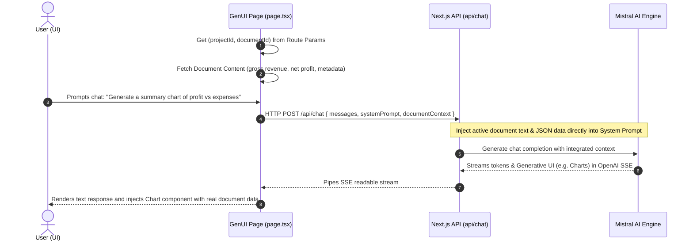
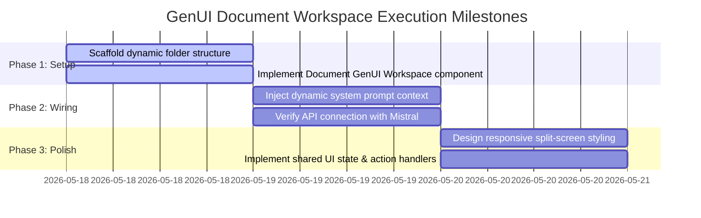

# OpenUI Document-GenUI Workspace Integration Plan

This plan outlines the architecture, routing structure, frontend split-screen layout, and backend system updates required to build a dynamic document conversation workspace under `projects/[projectId]/documents/[documentId]/genui`. 

The system will display the static document content side-by-side with an interactive OpenUI agent that automatically references the active document's data to generate live charts, tables, forms, and custom dashboard elements.

---

## 🗺️ 1. Next.js Routing Architecture

We will implement Next.js dynamic routing to retrieve identifiers for the active project and document, establishing a clean separation of concerns.

```text
src/app/
└── projects/
    └── [projectId]/
        └── documents/
            └── [documentId]/
                └── genui/
                    ├── page.tsx          # Main Split-Screen Layout (Client Component)
                    └── error.tsx         # Error boundary for dynamic rendering
```

### Dynamic Parameters:
*   **`projectId`**: References the current project container.
*   **`documentId`**: References the selected document to fetch and inject as context.

---

## 🎨 2. Dual-Pane UI Design (Split-Screen Workspace)

We will implement a responsive, premium split-screen workspace with shared React state:

```
+-----------------------------------------------------------------------------------+
|  [Logo] Project Alpha / Documents / Q4 Financials                                 |
+------------------------------------+----------------------------------------------+
|                                    |                                              |
|   LEFT PANE: DOCUMENT VIEW         |   RIGHT PANE: OPENUI PANEL                    |
|                                    |                                              |
|   +----------------------------+   |   +--------------------------------------+   |
|   | Document Title: Q4 Report  |   |   | [Chat Assistant: OpenUI Chat]        |   |
|   | Metadata: PDF | 12.4 MB    |   |   |                                      |   |
|   |                            |   |   | Assistant: "I've analyzed Q4 sales.  |   |
|   | ---- Content View ----     |   |   | Here is a graphical breakdown:"      |   |
|   |                            |   |   |                                      |   |
|   | Gross Revenue: $1,200,000  |   |   | [========== Chart Rendered ==========|   |
|   | Net Profit:    $340,000    |   |   | |  Line chart showing monthly sales   |   |
|   | Expenses:      $860,000    |   |   | |  plotted directly from the left    |   |
|   |                            |   |   | |  document's gross revenue metrics. |   |
|   |                            |   |   | +------------------------------------+   |
|   |                            |   |   |                                      |   |
|   |                            |   |   | [Type message...]             [Send] |   |
|   +----------------------------+   |   +--------------------------------------+   |
|                                    |                                              |
+------------------------------------+----------------------------------------------+
```

### Technical Spec:
*   **Left Pane (Document Viewer)**: Renders the structured content, text data, or metadata.
*   **Right Pane (OpenUI Panel)**: A customized version of our `<FullScreen>` component constrained to the right panel. It interacts with the backend and dynamically mounts generated visualizations.
*   **Shared State**: We will create a React context (or local state bridge) to let the Assistant write actions back to the Document view (such as highlighting sections and filling out form inputs automatically).

---

## 🔄 3. Workspace Flow & State Sharing



---

## ⚙️ 4. Code Implementation Details

### A. Document Dynamic Page: `src/app/projects/[projectId]/documents/[documentId]/genui/page.tsx`
Create the dynamic split view layout:

```tsx
"use client";

import React, { useEffect, useState } from "react";
import { useParams } from "next/navigation";
import { FullScreen } from "@openuidev/react-ui";
import { openAIMessageFormat, openAIReadableStreamAdapter } from "@openuidev/react-headless";
import { openuiLibrary, openuiPromptOptions } from "@openuidev/react-ui/genui-lib";

interface DocumentData {
  id: string;
  title: string;
  content: string;
  metadata: Record<string, any>;
}

export default function DocumentGenUIWorkspace() {
  const { projectId, documentId } = useParams();
  const [doc, setDoc] = useState<DocumentData | null>(null);
  const [loading, setLoading] = useState(true);

  // Fetch document details from mock API or local store
  useEffect(() => {
    async function fetchDoc() {
      try {
        // Replace with your database/API fetch: `/api/projects/${projectId}/documents/${documentId}`
        const fetchedDoc: DocumentData = {
          id: documentId as string,
          title: "Q4 Performance & Financial Audit",
          content: "Gross Revenue: $1,200,000. Operating Expenses: $860,000. Net Profit: $340,000. Growth rate: 12%. Key bottleneck: Supply chain overhead.",
          metadata: { fileType: "PDF", author: "Finance Director", created: "2026-05-15" }
        };
        setDoc(fetchedDoc);
      } catch (err) {
        console.error(err);
      } finally {
        setLoading(false);
      }
    }
    fetchDoc();
  }, [projectId, documentId]);

  if (loading) return <div className="p-8 text-center text-gray-500">Loading document workspace...</div>;
  if (!doc) return <div className="p-8 text-center text-red-500">Document not found.</motion.div>;

  // Compile system instructions with the dynamic document context embedded
  const baseSystemPrompt = openuiLibrary.prompt(openuiPromptOptions);
  const systemPrompt = `
${baseSystemPrompt}

CRITICAL CONTEXT:
You are assisting the user inside their workspace for the document "${doc.title}".
You MUST ground your answers, charts, forms, and tables in the document's real data:
---
DOCUMENT CONTENT:
${doc.content}

METADATA:
${JSON.stringify(doc.metadata, null, 2)}
---

When generating layout, charts, or tables, use the exact metrics (revenue, profit, growth rates) detailed above.
`;

  return (
    <div className="flex h-screen w-screen overflow-hidden bg-slate-950 text-slate-100">
      {/* LEFT PANE: Dynamic Document Viewer */}
      <div className="w-1/2 border-r border-slate-800 p-6 overflow-y-auto flex flex-col justify-between bg-slate-900/50">
        <div>
          <span className="text-xs font-semibold tracking-widest text-indigo-400 uppercase">Document Vault</span>
          <h1 className="mt-1 text-2xl font-bold tracking-tight text-white">{doc.title}</h1>
          <div className="mt-4 flex gap-3 text-xs text-slate-400">
            <span className="px-2 py-1 rounded bg-slate-800 border border-slate-700">Type: {doc.metadata.fileType}</span>
            <span className="px-2 py-1 rounded bg-slate-800 border border-slate-700">Author: {doc.metadata.author}</span>
            <span className="px-2 py-1 rounded bg-slate-800 border border-slate-700">Date: {doc.metadata.created}</span>
          </div>
          
          <div className="mt-8 prose prose-invert max-w-none">
            <h3 className="text-slate-200">Raw Extracted Content</h3>
            <p className="p-4 rounded-lg bg-slate-950/80 border border-slate-800/80 leading-relaxed text-slate-300 font-mono text-sm whitespace-pre-wrap">
              {doc.content}
            </p>
          </div>
        </div>
        
        <div className="mt-6 border-t border-slate-800 pt-4 text-xs text-slate-500">
          Project ID: <span className="font-mono text-slate-400">{projectId}</span> | Document ID: <span className="font-mono text-slate-400">{doc.id}</span>
        </div>
      </div>

      {/* RIGHT PANE: OpenUI Interactive Generation Interface */}
      <div className="w-1/2 h-full flex flex-col relative bg-slate-950">
        <FullScreen
          processMessage={async ({ messages, abortController }) => {
            return fetch("/api/chat", {
              method: "POST",
              headers: { "Content-Type": "application/json" },
              body: JSON.stringify({
                systemPrompt,
                messages: openAIMessageFormat.toApi(messages),
              }),
              signal: abortController.signal,
            });
          }}
          streamProtocol={openAIReadableStreamAdapter()}
          componentLibrary={openuiLibrary}
          agentName={`${doc.title} Advisor`}
        />
      </div>
    </div>
  );
}
```

### B. Route API Support (`src/app/api/chat/route.ts`)
The API route [route.ts](file:///f:/Source/Repos/genui-chat-app/src/app/api/chat/route.ts) is already configured to accept a dynamic `systemPrompt` body parameter:

```typescript
const { messages, systemPrompt } = await req.json();
```

This means **no backend API code changes are required** to support this integration! The client-side workspace dynamically updates and injects the document text directly into the request payload.

---

## 🚀 5. Step-by-Step Execution Plan



### Milestone 1: Create Directories & Dynamic Workspace
1. Create the workspace structure: `/src/app/projects/[projectId]/documents/[documentId]/genui/`.
2. Save the workspace client component.

### Milestone 2: Dynamic System Prompt Configuration
1. Grab the active document details.
2. Bind the document's structured data to the generated system prompt so Mistral operates with real-time semantic awareness.

### Milestone 3: Interactive Visual Validation
1. Ask the AI: *"Create a comparative chart of Q4 expenses vs profits from this document."*
2. Confirm the `Charts` component renders with perfect color styling and correct Swiss landscapes data in the right-hand panel.
