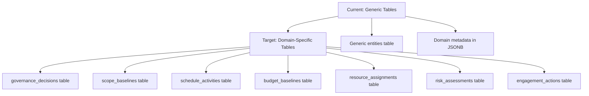
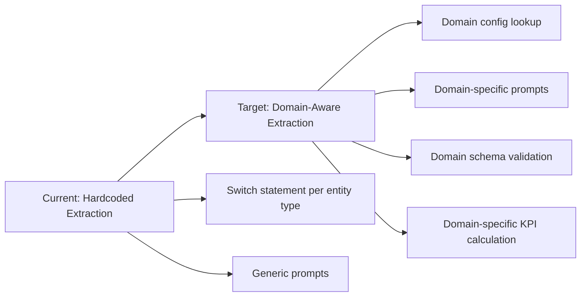
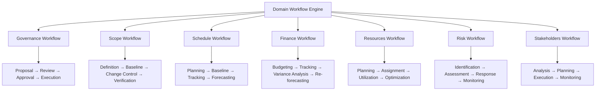

# Roadmap: Domain-Specific Knowledge Area Specializations for ADPA Command Center

**Date:** May 19, 2026  
**Status:** Planning Phase  
**Duration:** 20 Weeks  
**Current Progress:** 60% Complete

---

## Executive Summary

This roadmap provides a structured path to transform ADPA from a **technical framework with domain awareness** into a **domain-specialized Command Center** with operational intelligence across all 7 Knowledge Area Domains. The current system has strong foundations (60% complete) but lacks the operational specializations required for true domain-specific functionality.

---

## Current State vs Target State Analysis

### Current State (60% Complete)

**✅ Completed Foundations:**
- TypeScript types and domain definitions for all 15 domains (8 Performance + 7 Knowledge)
- Domain extraction configurations with prompts, schemas, and KPIs for all domains
- Database enum extension with all 15 domains
- Performance Domain tables (Tier 1) fully implemented
- UI domain grouping with three-tier weighted allocation system
- Entity-to-domain mapping with 67 entities across 7 Knowledge Domains

**❌ Critical Gaps:**
- Knowledge Area Domain tables: 0% complete (38 missing tables)
- Extraction service integration: 30% complete (hardcoded logic, not using domain configs)
- Domain-specific extraction methods: 0% complete
- Save methods for Knowledge Domain entities: 0% complete
- Domain-aware analytics: 0% complete

### Target State: Domain-Specialized Command Center

**Vision:** Each Knowledge Area Domain operates as a specialized intelligence module with:
- Domain-specific data structures and validation rules
- Domain-aware extraction with specialized prompts
- Domain-specific workflows and business logic
- Domain-specific KPIs and analytics
- Domain-specific user interfaces
- Integration with RPAS governance as central foundation

---

## Architectural Changes Required

### 1. Database Layer Transformation

**Current:** Generic entity tables with domain metadata  
**Target:** Domain-specific tables with specialized schemas

**Required Changes:**



**Implementation:** Create 38 new database tables across 7 domains:

| Domain | Tables Required | Key Specializations |
|--------|----------------|-------------------|
| Governance | 5 tables | Decision chains, approval workflows, compliance tracking |
| Scope | 5 tables | WBS hierarchy, change control, traceability matrices |
| Schedule | 5 tables | Critical path analysis, variance tracking, forecasting |
| Finance | 6 tables | EVM metrics, funding tranches, procurement costs |
| Resources | 6 tables | Capacity planning, utilization tracking, conflict resolution |
| Risk | 7 tables | Risk register, assessments, response plans, triggers |
| Stakeholders Ops | 5 tables | Engagement tracking, communication logs, satisfaction surveys |

---

### 2. Extraction Service Architecture

**Current:** Hardcoded switch statements for entity types  
**Target:** Domain-aware extraction with specialized prompts and validation

**Required Changes:**



**Implementation Pattern:**

```typescript
// Current (hardcoded)
async extractSingleEntityType(entityType: string, documents: Document[]) {
  switch (entityType) {
    case 'stakeholders':
      return this.extractStakeholders(documents)
    case 'risks':
      return this.extractRisks(documents)
    // ... 50+ more cases
  }
}

// Target (domain-aware)
async extractDomainEntities(domain: PmbokDomain, documents: Document[]) {
  const config = getDomainExtractionConfig(domain)
  const prompt = this.buildDomainPrompt(config, documents)
  const schema = this.getDomainSchema(domain)
  const validation = this.getDomainValidationRules(domain)
  
  const result = await aiService.generateWithFallback(prompt, {
    schema,
    validation,
    providers: config.recommendedProviders
  })
  
  const kpis = this.calculateDomainKPIs(domain, result)
  return { entities: result, kpis }
}
```

---

### 3. Domain-Specific Validation Layer

**Current:** Generic validation rules  
**Target:** Domain-specific validation with business logic enforcement

**Required Changes:**

```typescript
// Domain-specific validation schemas
const DOMAIN_VALIDATION_SCHEMAS: Record<PmbokDomain, z.ZodSchema> = {
  governance: GovernanceDecisionSchema,
  scope: ScopeBaselineSchema,
  schedule: ScheduleActivitySchema,
  finance: BudgetBaselineSchema,
  resources: ResourceAssignmentSchema,
  risk: RiskAssessmentSchema,
  stakeholders_ops: EngagementActionSchema
}

// Domain-specific business logic validators
const DOMAIN_BUSINESS_VALIDATORS: Record<PmbokDomain, BusinessValidator> = {
  schedule: {
    validateStateTransition: (from: string, to: string) => {
      // Schedule-specific state machine
      const validTransitions = {
        'not_started': ['in_progress', 'on_hold'],
        'in_progress': ['completed', 'delayed', 'on_hold'],
        'delayed': ['in_progress', 'on_hold'],
        'completed': [] // Terminal state
      }
      return validTransitions[from]?.includes(to) ?? false
    },
    validateDependencies: (activity: ScheduleActivity) => {
      // Ensure predecessors are completed before starting
    }
  },
  finance: {
    validateBudgetVariance: (variance: number) => {
      // Alert if variance exceeds threshold
    },
    validateEVMCalculation: (evm: EarnedValueMetrics) => {
      // Ensure CPI, SPI calculations are correct
    }
  }
  // ... other domains
}
```

---

### 4. Domain-Specific Workflow Engine

**Current:** Generic document processing pipeline  
**Target:** Domain-specific workflows with state machines

**Required Changes:**



---

## Implementation Roadmap

### Phase 1: Database Foundation (Weeks 1-4)

**Objective:** Create the data structures required for domain-specific operations

**Tasks:**

1. **Create Knowledge Area Domain Tables** (Week 1-2)
   - Implement 38 database tables across 7 domains
   - Add foreign key constraints to projects and documents
   - Create indexes for performance optimization
   - Implement RLS policies for domain-level access control

2. **Implement Domain Schema Validation** (Week 2-3)
   - Create Zod schemas for all 38 domain entity types
   - Implement domain-specific validation rules
   - Add field normalization and sanitization
   - Create schema migration utilities

3. **Implement Save Methods** (Week 3-4)
   - Create idempotent upsert methods for all domain entities
   - Implement conflict handling and resolution
   - Add field validation and normalization
   - Create bulk save operations for efficiency

**Success Criteria:**
- All 38 domain tables created and tested
- Schema validation working for all entity types
- Save methods handling conflicts correctly
- Performance benchmarks met (<100ms per entity save)

---

### Phase 2: Domain-Aware Extraction Service (Weeks 5-8)

**Objective:** Transform extraction from entity-centric to domain-centric

**Tasks:**

1. **Refactor Extraction Service** (Week 5-6)
   - Replace hardcoded switch statements with domain config lookup
   - Integrate domain-specific prompts from configs
   - Implement domain schema validation in extraction pipeline
   - Add domain-specific AI provider selection

2. **Implement Domain Extraction Methods** (Week 6-7)
   - Create extraction methods for all 7 Knowledge Area domains
   - Implement domain-specific prompt engineering
   - Add domain-specific context gathering
   - Create domain-specific result post-processing

3. **Integrate Domain KPI Calculation** (Week 7-8)
   - Implement KPI calculation for each domain
   - Add domain-specific metrics and scoring
   - Create KPI trend analysis
   - Implement KPI-based alerting

**Success Criteria:**
- Extraction service using domain configs
- Domain-specific prompts improving extraction quality by 20%+
- KPI calculations accurate and consistent
- Extraction latency within acceptable bounds (<30s per domain)

---

### Phase 3: Domain-Specific Workflows (Weeks 9-12)

**Objective:** Implement domain-specific business logic and workflows

**Tasks:**

1. **Implement Domain State Machines** (Week 9-10)
   - Create state machines for each domain's entity lifecycle
   - Implement state transition validation
   - Add state transition audit trails
   - Create state-based access control

2. **Implement Domain Business Logic** (Week 10-11)
   - Create domain-specific business rule validators
   - Implement domain-specific calculations (e.g., critical path, EVM)
   - Add domain-specific cross-entity validations
   - Create domain-specific notification rules

3. **Integrate with RPAS Governance** (Week 11-12)
   - Ensure all domain state changes follow RPAS guardrails
   - Implement governance checkpoints in domain workflows
   - Add audit trail integration with domain operations
   - Create domain-specific approval workflows

**Success Criteria:**
- State machines preventing invalid transitions
- Business logic enforcing domain rules
- RPAS governance integrated across all domains
- Audit trails complete for all domain operations

---

### Phase 4: Domain-Specific Analytics (Weeks 13-16)

**Objective:** Create domain-specific intelligence and reporting

**Tasks:**

1. **Implement Domain Analytics Engine** (Week 13-14)
   - Create domain-specific aggregation queries
   - Implement domain trend analysis
   - Add domain cross-correlation analysis
   - Create domain anomaly detection

2. **Create Domain Dashboards** (Week 14-15)
   - Build domain-specific UI components
   - Implement domain KPI visualizations
   - Add domain trend charts and heatmaps
   - Create domain-specific drill-down interfaces

3. **Implement Domain Alerting** (Week 15-16)
   - Create domain-specific alert rules
   - Implement domain threshold monitoring
   - Add domain alert escalation logic
   - Create domain alert notification channels

**Success Criteria:**
- Analytics engine providing domain insights
- Dashboards showing domain-specific KPIs
- Alerting preventing domain issues
- User adoption of domain analytics >50%

---

### Phase 5: Command Center Integration (Weeks 17-20)

**Objective:** Integrate domain specializations into unified Command Center

**Tasks:**

1. **Implement Command Center Orchestration** (Week 17-18)
   - Create domain coordination layer
   - Implement cross-domain workflow orchestration
   - Add domain dependency management
   - Create domain conflict resolution

2. **Build Command Center UI** (Week 18-19)
   - Create unified Command Center dashboard
   - Implement domain-specific control panels
   - Add cross-domain visualization
   - Create domain health monitoring

3. **Implement BABOK/DMBOK Integration** (Week 19-20)
   - Convert BABOK templates to operational workflows
   - Implement DMBOK data governance operations
   - Add framework-specific validation rules
   - Create framework compliance reporting

**Success Criteria:**
- Command Center providing unified project view
- Domain coordination working smoothly
- BABOK/DMBOK operational integration complete
- Framework compliance reporting accurate

---

## Domain-Specific Implementation Details

### Governance Domain Specialization

**Data Structures:**
- `governance_decisions`: Decision records with outcome, rationale, approvers
- `approval_workflows`: Multi-stage approval chains with gates
- `steering_committees`: Committee composition, mandate, meeting outcomes
- `change_control_boards`: Authority levels, decision scope
- `policy_compliance`: Compliance status, audit findings

**Business Logic:**
- Decision state machine: Proposed → Reviewed → Approved → Executed → Closed
- Approval workflow engine with parallel/sequential gates
- Compliance scoring with automated violation detection
- Authority validation based on RPAS guardrails

**KPIs:**
- Decision cycle time
- Approval workflow efficiency
- Compliance score
- Policy violation count

---

### Scope Domain Specialization

**Data Structures:**
- `scope_baselines`: Scope statements, boundaries, inclusions/exclusions
- `wbs_nodes`: Hierarchical work breakdown with ownership
- `scope_change_requests`: Impact analysis, approval status
- `requirements_traceability`: Traceability matrices
- `scope_verification`: Acceptance status, verification criteria

**Business Logic:**
- WBS hierarchy validation (no circular dependencies)
- Scope change impact analysis
- Requirements traceability validation
- Scope creep detection and alerting

**KPIs:**
- Scope stability index
- Change request cycle time
- Requirements coverage
- Scope verification pass rate

---

### Schedule Domain Specialization

**Data Structures:**
- `schedule_baselines`: Baseline milestones and dates
- `schedule_activities`: Activities with duration, dependencies
- `critical_path`: Critical path activities with float analysis
- `schedule_variances`: Variance analysis with root cause
- `schedule_forecasts`: ETC, EAC for schedule

**Business Logic:**
- Critical path calculation algorithm
- Schedule variance analysis
- Dependency validation (no circular dependencies)
- Schedule forecasting with Monte Carlo simulation

**KPIs:**
- Schedule Performance Index (SPI)
- Milestone hit rate
- Critical path stability
- Schedule accuracy

---

### Finance Domain Specialization

**Data Structures:**
- `budget_baselines`: Budget by phase, category, WBS
- `cost_actuals`: Actual costs by period and category
- `cost_estimates`: EAC, ETC, VAC calculations
- `funding_tranches`: Funding sources with release conditions
- `financial_variances`: Variance analysis with root cause
- `procurement_costs`: Procurement tracking

**Business Logic:**
- EVM calculation engine (PV, EV, AC, CPI, SPI, EAC, ETC)
- Budget variance analysis
- Funding tranche release automation
- Procurement cost validation

**KPIs:**
- Cost Performance Index (CPI)
- Budget utilization rate
- Funding availability
- Procurement efficiency

---

### Resources Domain Specialization

**Data Structures:**
- `resource_assignments`: Assignments with allocation percentage
- `resource_pool`: Skills, availability, cost rates
- `capacity_forecasts`: Capacity by role and skill
- `utilization_records`: Planned vs actual utilization
- `resource_conflicts`: Overallocation detection and resolution
- `onboarding_offboarding`: Onboarding plans with dates

**Business Logic:**
- Resource conflict detection algorithm
- Capacity planning optimization
- Utilization variance analysis
- Skill gap identification

**KPIs:**
- Resource utilization rate
- Conflict resolution time
- Skill gap count
- Capacity forecast accuracy

---

### Risk Domain Specialization

**Data Structures:**
- `risk_register`: Complete risk register with full details
- `risk_assessments`: P×I and RPN calculations
- `risk_response_plans`: Response strategies with actions
- `risk_triggers`: Early warning indicators
- `risk_reviews`: Status change records
- `contingency_reserves`: Reserve allocation and consumption
- `risk_metrics`: Risk trends and exposure

**Business Logic:**
- Risk scoring algorithm (P×I×D)
- Risk response strategy recommendation
- Trigger monitoring and alerting
- Reserve consumption tracking

**KPIs:**
- Risk exposure index
- Response coverage rate
- Trigger hit rate
- Reserve utilization

---

### Stakeholders Operations Domain Specialization

**Data Structures:**
- `engagement_actions`: Actions with outcomes and follow-up
- `communication_logs`: Communication with sentiment analysis
- `satisfaction_surveys`: NPS and feedback themes
- `stakeholder_issues`: Issues with resolution status
- `relationship_health`: Health indicators over time

**Business Logic:**
- Engagement effectiveness scoring
- Sentiment trend analysis
- Issue escalation logic
- Relationship health calculation

**KPIs:**
- Engagement action completion rate
- Sentiment trend
- NPS score
- Issue resolution time

---

## Risk Mitigation Strategies

### Technical Risks

**Risk:** Database migration complexity with 38 new tables  
**Mitigation:**
- Phased rollout by domain
- Comprehensive testing in staging environment
- Rollback procedures for each migration
- Performance testing with realistic data volumes

**Risk:** Extraction service refactoring breaking existing functionality  
**Mitigation:**
- Feature flags for gradual rollout
- Parallel operation of old and new services
- Comprehensive integration testing
- Monitoring and alerting during transition

**Risk:** Domain-specific business logic complexity  
**Mitigation:**
- Domain expert review of business rules
- Extensive unit and integration testing
- Business logic validation against real project data
- Gradual enablement of business rules

### Operational Risks

**Risk:** User adoption resistance to new domain-specific workflows  
**Mitigation:**
- Comprehensive training programs
- Gradual rollout with pilot users
- Documentation and runbooks
- Support during transition period

**Risk:** Performance degradation with domain-specific processing  
**Mitigation:**
- Performance benchmarking at each phase
- Caching strategies for domain calculations
- Query optimization for domain-specific queries
- Scalability testing with realistic loads

---

## Success Metrics

### Technical Metrics

- **Database Migration Success:** 100% of tables migrated without data loss
- **Extraction Quality Improvement:** 20%+ improvement in extraction accuracy
- **Extraction Latency:** <30s per domain extraction
- **KPI Calculation Accuracy:** 95%+ accuracy vs manual calculation
- **System Performance:** <100ms per entity save, <500ms per domain query

### Business Metrics

- **Domain Coverage:** 100% of 7 Knowledge Area Domains operational
- **User Adoption:** 50%+ of projects using domain-specific features within 1 month
- **Compliance Score:** 90%+ compliance with PMBOK, BABOK, DMBOK standards
- **Decision Quality:** 25%+ improvement in decision-making speed
- **Issue Reduction:** 30%+ reduction in domain-specific project issues

---

## Conclusion

This roadmap provides a structured 20-week path to transform ADPA into a domain-specialized Command Center. The phased approach minimizes risk while delivering incremental value. The key success factors are:

1. **Strong Foundation:** Leverage existing 60% completion (types, configs, Performance Domains)
2. **Domain-First Approach:** Build domain specializations before Command Center integration
3. **Governance Integration:** Ensure RPAS guardrails protect all domain operations
4. **Incremental Delivery:** Each phase delivers usable functionality
5. **Continuous Validation:** Testing and validation at each phase

The result will be a true Command Center with domain-specific intelligence, enabling project management professionals to make better decisions through specialized insights across all Knowledge Area Domains.

---

**Prepared by:** Menno Drescher  
**Date:** May 19, 2026
