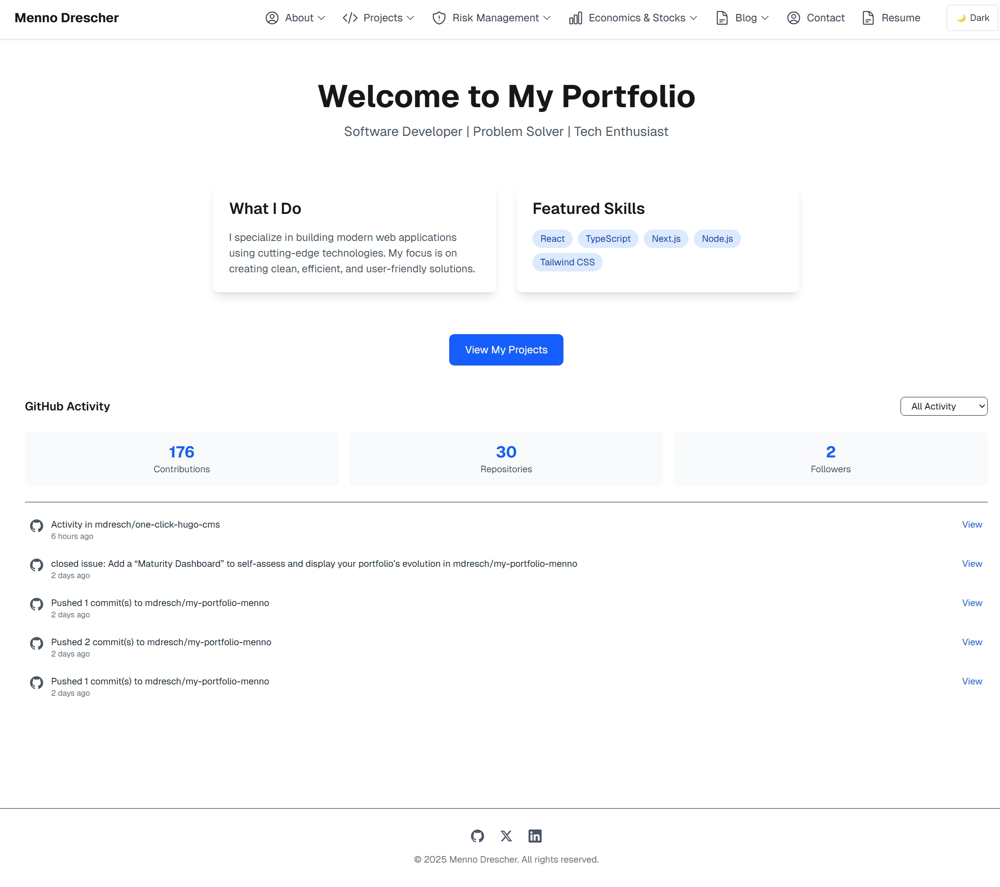

# Welcome to My Portfolio Menno

Explore an interactive overview of all the amazing features my portfolio has to offer, along with beautifully crafted, dynamic documentation to showcase my work.

You'll get to experience the best parts of my portfolio in action—and discover step-by-step guidance on how to transform this template into your own unique showcase.

## Documentation Library for My Portfolio – Menno

Welcome to the comprehensive documentation library for my portfolio, Menno. This section is designed to serve both as an interactive guide to understanding how my portfolio is built and as a resource for anyone interested in turning this template into their own unique showcase.

### What You’ll Discover

* **In-Depth Feature Breakdowns:** Explore detailed guides on the amazing features that bring my portfolio to life, including interactive components and best practices in web design.
* **Step-by-Step Setup and Customization:** Learn how to set up your own copy of this portfolio template, customize it to fit your vision, and integrate your content seamlessly.
* **Technical Guides and Code Walkthroughs:** Get a behind-the-scenes look at the code architecture, including how I use modern tools like Next.js  and next/font to create an optimized, dynamic experience.
* **Best Practices and Resources:** Find curated resources, tutorials, and documentation best practices to help you build and document your projects effectively.

### Get Started

Whether you’re here to get inspired or to learn how you can build something similar, this library is your starting point. Navigate through the sections to learn more about the underlying technologies, customize the template, and transform it into your very own portfolio masterpiece.

Happy exploring!

<figure><figcaption></figcaption></figure>

### Jump right in

<table data-view="cards"><thead><tr><th></th><th></th><th data-hidden data-card-cover data-type="files"></th><th data-hidden></th><th data-hidden data-card-target data-type="content-ref"></th></tr></thead><tbody><tr><td><strong>Getting Started</strong></td><td>Create your first site</td><td></td><td></td><td><a href="getting-started/quickstart.md">quickstart.md</a></td></tr><tr><td><strong>Basics</strong></td><td>Learn the basics of GitBook</td><td></td><td></td><td><a href="broken-reference">Broken link</a></td></tr><tr><td><strong>Publish your docs</strong></td><td>Share your docs online</td><td></td><td></td><td><a href="getting-started/publish-your-docs.md">publish-your-docs.md</a></td></tr></tbody></table>
