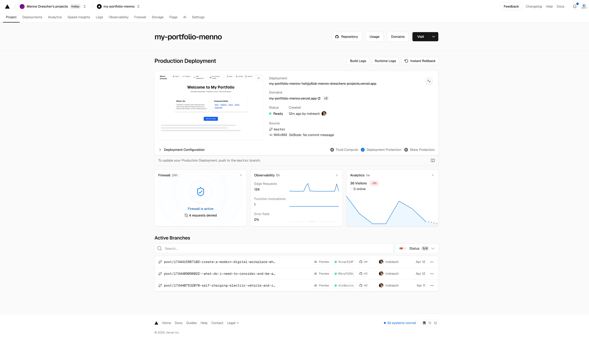

# Quickstart My-Portfolio

## Welcome to Your Next.js Project

## This project was bootstrapped with **create-next-app**.

### Getting Started

To kick things off, start the development server with one of the following commands:

bash

```
npm run dev
# or
yarn dev
# or
pnpm dev
# or
bun dev
```

Then, open http://localhost:3000 in your browser to see your app in action.

You can begin editing the page by modifying `app/page.tsx`. The page will automatically update as you save your changes.

This project uses `next/font` to automatically optimize and load **Geist**, a modern font family designed for Vercel.

### Learn More

To dive deeper into Next.js, check out these resources:

* Next.js Documentation — Get the full lowdown on Next.js  features and APIs.
* Learn Next.js — An interactive tutorial that takes you through Next.js  fundamentals.
* Next.js GitHub Repository — Your feedback and contributions are welcome!

### Deploy on Vercel

The easiest way to deploy your Next.js  app is to use the Vercel Platform, created by the makers of Next.js..

<figure><figcaption></figcaption></figure>

For more details, see the Next.js deployment documentation.

#### **Beautiful documentation starts with the content you create, and GitBook makes it effortless to work with both new and pre-existing content.**

* **Write from Scratch:** If you're new to creating content, check out our Basics section. It covers everything you need to know about writing great documentation from the ground up.
* **Import Existing Content:** Already have content? No problem. GitBook supports importing files from many popular writing tools and formats. Simply upload one or more files, and GitBook will import your content seamlessly.

### **Sync a Repository**

GitBook lets you set up a two-way sync with an existing GitHub or GitLab repository. With Git Sync enabled, you and your team can work seamlessly—editing your content directly in GitBook or writing in your code editor—while ensuring your documentation stays perfectly up-to-date across both platforms.
