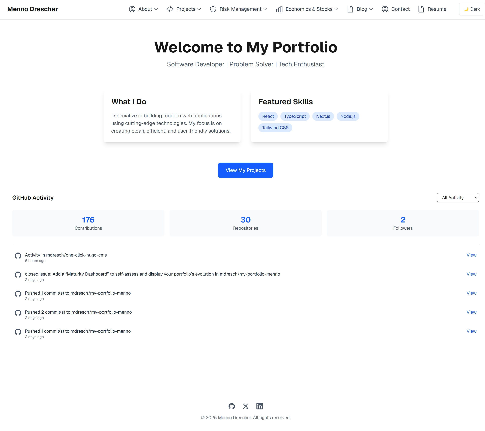

# Home

### **File Overview**

* **Entry Point:** The file defines the default export — a functional component (`Home`) — that renders the main page of your application.
*   **Structured Data Injection:** At the top of the component, it imports helper functions (`generatePersonStructuredData` and `generateWebsiteStructuredData`) from your structured-data library. These functions generate JSON-LD scripts used for SEO and providing search engines detailed information about:

    * The person behind the portfolio.
    * The website itself.

    These JSON objects are then embedded directly into the page via `<script>` tags with `type="application/ld+json"`, using `dangerouslySetInnerHTML` to inject the JSON safely.
* **Base URL Definition:** A constant `baseUrl` is defined to ensure consistency in URLs (set to `https://my-portfolio-menno.vercel.app/`). This is used by the structured data generating functions.

### **Main Content Layout**

* **Header Section:** The component renders a header inside a `<main>` element that is centered and padded:
  * A large, bold heading ("Welcome to My Portfolio") welcomes visitors.
  * A tagline ("Software Developer | Problem Solver | Tech Enthusiast") provides a quick snapshot of your professional identity.
* **Overview Sections in a Grid Layout:** There’s a two-column grid that highlights:
  * **What I Do:** A section describing your specialization in building modern, user-friendly web applications.
  * **Featured Skills:** A dynamically generated list of skills (e.g., React, TypeScript, Next.js, Node.js, Tailwind CSS), each rendered as a styled badge.
* **Call to Action:** A prominent button labeled "View My Projects" directs visitors to another page where they can explore your work in greater detail.

### **Additional Features**

* **GitHub Activity Section:** Below the main content, there is a dedicated section that integrates a `GitHubActivity` component. This component is likely responsible for displaying your recent GitHub contributions or project updates, further showcasing your active involvement in development.

### **Why This Setup is Effective**

* **SEO-Friendly:** By injecting structured data (JSON-LD), you ensure that search engines understand both your personal brand and your website. This improves visibility and may positively influence search rankings.
* **Dynamic and Responsive Design:** The use of utility classes (from Tailwind CSS, for example) ensures a responsive layout that adapts to different screen sizes.
* **Modular and Scalable Architecture:** By separating concerns (using components like `GitHubActivity` and utility functions for structured data), the codebase remains maintainable and scalable.
* **Interactive User Experience:** With clear calls to action (like the "View My Projects" button) and a focus on engaging content, visitors are encouraged to explore further, creating an interactive and dynamic experience.

In summary, this file is the core entry point for your portfolio, setting up both the visual layout and the technical SEO optimizations necessary for a compelling web presence. It seamlessly blends content, style, and functionality to tell your story while showcasing your skills and projects.

<figure><figcaption></figcaption></figure>
